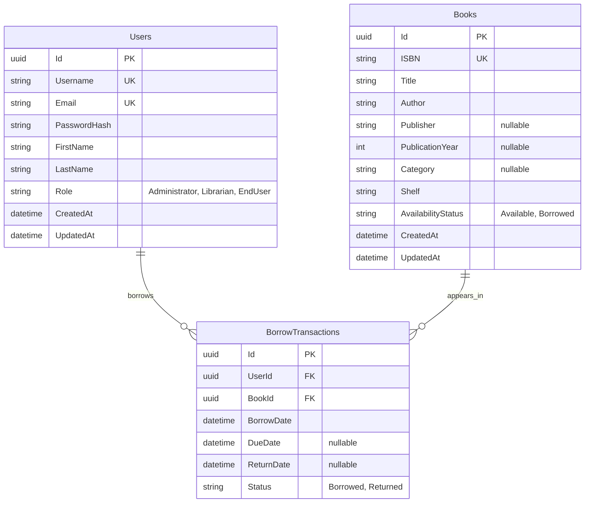

# Library Management Backend (Archelik Hitachi test)

.NET 8 backend for library inventory, authentication, borrowing, returns, and
transaction history. It follows a three-tier dependency direction.

## Project structure

```text
src/
  LibraryManagement.Api/          Presentation layer
  LibraryManagement.Business/     Business layer
  LibraryManagement.DataAccess/   Data access layer
tests/
  LibraryManagement.Business.UnitTests/
```

Dependencies flow from `Api` to `Business` to `DataAccess`. 

## Using of AI Assistance
*First AI Used for initiate project structure.*
### Prompt
```
Initiate API with three-tier architecture using dotnet framework 8.0 with following context
- Library management system.
- Init JWT Authentication
- Controller contain : BooksController, UsersController, Borrow/Return Controller
- Implement exception handler
- Use Postgresql for Database, work with entity framework
- Add data seeder mechanism for development phase
- Make application containerized and provision docker-compose file
```
*Right after I got the result, generated project structure are so minimal, compact. But it also not so clean and hard to understand, Then I remove and re-create it again*
### Prompt
```
Generate project structure with three-tier architecture using dotnet framework 8, prepare package for postgresql connecting. Leave room for implementation empty for developer.
```
*then I keep adding controller one-by-one, after finish Controller and endpoint structuring, interfaces and implementation. AI also be my assistance on doing dependencies injection*
### Prompt
```
With interface and implementation done in "LibraryManagement.Business" assist me to implement dependencies injection in practical ways
```
**I also use AI Assistance on much more part, such as implement database connection, and also data seeding*

## Run locally

Install a .NET 8-compatible SDK, then run:

```bash
dotnet restore
dotnet test
dotnet run --project src/LibraryManagement.Api
```

But for the non-containerized API workflow, first start PostgreSQL with the local
port override, then run the API:

```bash
docker compose -f compose.yaml -f compose.local-db.yaml up -d postgres
dotnet run --project src/LibraryManagement.Api
```

Or

## Run with Docker Compose

Optionally copy `.env.example` to `.env` and replace the development JWT secret,
then start the API and PostgreSQL:

```bash
docker compose up --build
```

The API is exposed at <http://localhost:8080> and Swagger at
<http://localhost:8080/swagger>. PostgreSQL remains private to the Compose network
to avoid host-port conflicts and unnecessary database exposure. EF Core migrations
run automatically in the local Compose environment.

For local development, Compose creates an initial administrator when no
administrator exists:

- Username: `admin`
- Password: `Admin54321Dev`

Override all development credentials through `.env`;

Stop the services with:

```bash
docker compose down
```

Use `docker compose down --volumes` if you intentionally want to remove
the local database data.

### Sample data for local development

Docker Compose enables idempotent sample-data seeding by default. On startup the
API applies migrations, creates the bootstrap administrator, and inserts any
missing sample librarian, member, and catalog books. Existing records are left
unchanged, so restarting the stack does not duplicate data.

| Role | Username | Password |
| --- | --- | --- |
| Administrator | `admin` | `Admin54321Dev` |
| Librarian | `librarian` | `Librarian12345` |
| End User | `member` | `Member123456` |

Ten books across software engineering, fiction, history, and classics are also
created with stable ISBNs. Copy `.env.example` to `.env` to customize credentials,
or set `SEED_DATA_ENABLED=false` to disable the librarian, member, and book seed.
The bootstrap administrator remains controlled separately by the `ADMIN_*`
variables.

For a completely fresh local dataset, intentionally remove the Compose volume:

```bash
docker compose down --volumes
docker compose up --build
```

Sample seeding is disabled in the base application configuration and is enabled
explicitly by `compose.yaml`, preventing accidental sample accounts in other
deployment environments.

## Production configuration

`compose.yaml` is a local-development stack, not a production deployment manifest.
Production deployments must provide `ConnectionStrings__DefaultConnection` and a
unique `Jwt__Secret` of at least 32 characters through a secret manager. They
should also override `Jwt__Issuer`, `Jwt__Audience`, and `AllowedHosts` for the
deployed domains.

The safe base defaults keep sample seeding, bootstrap-account creation, automatic
migrations, Swagger, and application-level HTTPS redirects disabled. Apply EF
migrations as a separate deployment step before starting multiple API replicas.
TLS should normally terminate at the ingress or reverse proxy; enable
`Http__UseHttpsRedirection=true` only when the application receives and understands
the original HTTPS scheme. Never set `SeedData__Enabled=true` outside the
`Development` environment—the application rejects that configuration at startup.

## Hosts and CORS

HTTP host filtering and browser CORS are configured independently:

- `ALLOWED_HOSTS` controls accepted HTTP `Host` headers. Separate multiple hosts
  with semicolons, for example `api.example.com;internal-api.example.com`.
- `CORS_ALLOWED_ORIGINS` controls which browser origins receive CORS headers.
  Separate origins with commas or semicolons, for example
  `https://app.example.com,https://admin.example.com`.

For local Docker development, edit `.env` and apply the change:

```bash
docker compose up -d --force-recreate backend
```

Origins must include the scheme and optional port, with no path or trailing slash.
Set `CORS_ALLOWED_ORIGINS=*` only when intentionally allowing every browser origin.
This API uses bearer tokens and does not enable credentialed cross-origin cookies,
so wildcard CORS remains compatible with the current authentication design. For
production, prefer an explicit origin allowlist and set `ALLOWED_HOSTS` to the API's
actual public and internal hostnames.

## Authentication

Log in with either a username or email:

```bash
curl --request POST http://localhost:8080/api/auth/login \
  --header 'Content-Type: application/json' \
  --data '{"usernameOrEmail":"admin","password":"Admin54321Dev"}'
```

Use the returned access token as `Authorization: Bearer <token>`. The following
endpoints are available:

| Method | Endpoint | Access |
| --- | --- | --- |
| `POST` | `/api/auth/login` | Anonymous |
| `POST` | `/api/auth/register` | Administrator only |
| `GET` | `/api/auth/me` | Authenticated users |
| `GET` | `/api/users/end-users` | Administrator or Librarian |

Registration supports the roles `Administrator`, `Librarian`, and `EndUser`.
Passwords are stored only as bcrypt hashes.

The end-user list returns each end user's `id` and `username`, ordered by username,
so authorized staff can select a borrower and pass the corresponding `userId` to
the borrowing endpoint.

## Database schema

The initial migration creates `Users`, `Books`, and `BorrowTransactions`, with
unique indexes for usernames, email addresses, and ISBNs, plus restricted foreign
keys that protect transaction history.



Each user and book can have many historical borrowing transactions. Both foreign
keys use restricted deletion so transaction history cannot be orphaned.

## Book inventory

Book reads and searches are public. Creating, updating, and deleting books requires
an `Administrator` or `Librarian` token.

| Method | Endpoint | Access |
| --- | --- | --- |
| `GET` | `/api/books/{id}` | Public |
| `GET` | `/api/books` | Public |
| `GET` | `/api/books/search` | Public |
| `POST` | `/api/books` | Administrator or Librarian |
| `PUT` | `/api/books/{id}` | Administrator or Librarian |
| `DELETE` | `/api/books/{id}` | Administrator or Librarian |

List and search accept `isbn`, `title`, `author`, `category`, `availability`,
`page`, `pageSize`, `sortBy`, and `sortOrder`. ISBN values are unique, and books
with an active borrowing cannot be deleted.

## Borrowing and transaction history

All borrowing endpoints require a bearer token. Administrators and librarians can
borrow or return on behalf of any user. End users can borrow and return only their
own books and can only view their own history. Administrators can view global
history; librarians can use the same endpoint with a required end-user `userId`.

| Method | Endpoint | Access |
| --- | --- | --- |
| `POST` | `/api/borrowings` | Any user; `userId` override for Administrator/Librarian |
| `POST` | `/api/borrowings/{transactionId}/return` | Owner, Administrator, or Librarian |
| `GET` | `/api/borrowings/{transactionId}` | Owner, Administrator, or Librarian |
| `GET` | `/api/borrowings/mine` | Authenticated user's history |
| `GET` | `/api/borrowings` | Administrator global history; Librarian with an end-user `userId` |
